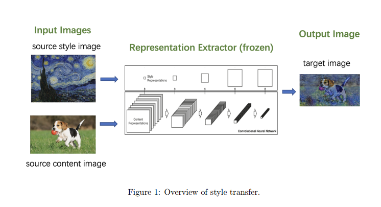

# Neural Style Transfer in Tensorflow

## Project Summary

In this part you will implement style transfer based on the paper: “A Neural Algorithm of Artistic Style”: https://arxiv.org/pdf/1508.06576.pdf.
Basically, we will build a system that can take in two images (one input content image and one input style image), and output another image whose content is closest to the content of the content image while style is closest to the style of the style image.

As depicted in Fig. 1, neural style transfer is able to generate an image whose content is close to the content image (a dog running on the grass with a ball in its mouth), but painted in the style of the style image (Van Gogh’s ”The Starry Night”). As the name suggests, it transfers the ”style” of one image to another one. With this technique, we can obtain for an arbitrary image, its equivalent in different artwork styles. Towards this end, we consider two aspects of an image’s representation, content representation and style representation. We make the assumption that we could have a pre-trained image encoder as a representation extractor that is able to disentangle content information and style information of an image. We also assume some intermediate layers capture content representation and some capture style representation. And the target image is expected to be close to the source content image in terms of the content representation, and close to the source style image in terms of the style representation.

Specifically, we utilize a pre-trained VGG model and keep its parameters frozen. We define the layers of interest within the model: content layers and style layers. For a given image, we refer to the output features of the content layers within the model with this image as the input, as the content representations of the image (w.r.t. the model). Like-wise, we define for an image its style representation (w.r.t. the model) as the gram matrix of the output features of the style layers within the model with this image as the input. For example, for a 5-layer perceptron, if we select the content layers to be the second and fourth layer, then
the content representation of an image would be the output features from the second and fourth layer. The training objective is to find an output image that could minimize the combination of content loss and style loss, where content loss is the distance between the content representation of the input content image and the output image, and style loss is the distance between the style representation of the input style image and the output image. The only trainable tensor is the output image, which could be optimized via gradient descent.